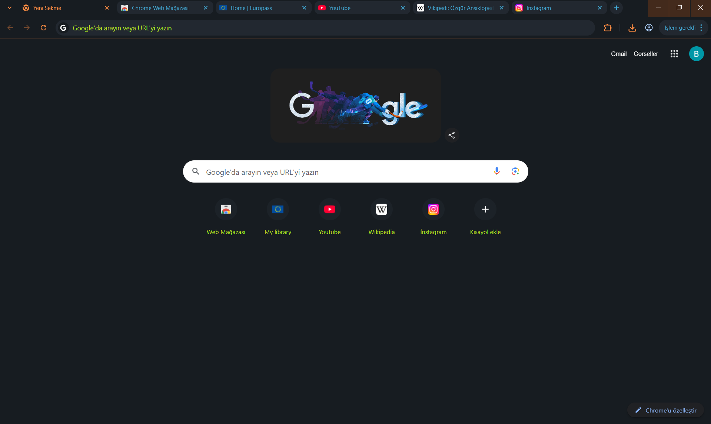

# B - Cube

<div align="center">

[](LICENSE)
[](https://www.google.com/chrome/)


Minimal, modern Chrome theme (dark only).

**B - Cube**, Chrome için yalnızca koyu modda kullanılabilen, sade ve modern bir temadır.

**Kaynak / Source:** [github.com/bahadir-b-bekdemir/themes → google-chrome-themes/b-cube](https://github.com/bahadir-b-bekdemir/themes/tree/main/google-chrome-themes/b-cube)

</div>

---

## Kendi bilgisayarında yükleme / Install on your computer

1. Bu depoyu indirin veya klonlayın. / *Download or clone this repository.*
2. Chrome’da adres çubuğuna `chrome://extensions` yazıp gidin. / *In Chrome, go to `chrome://extensions`.*
3. **Geliştirici modu**nu açın. / *Turn on **Developer mode**.*
4. **Paketlenmemiş öğe yükle** / **Load unpacked** ile `manifest.json` dosyasının bulunduğu `b-cube` klasörünü seçin.  
   *Click **Load unpacked** and select the `b-cube` folder that contains `manifest.json`.*

Tema etkinleşir; Chrome ayarlarından **Görünüm → Temalar** ile temayı seçebilirsiniz.  
*The theme activates; you can select it via **Appearance → Themes** in Chrome settings.*

---

## Görünüm / Preview

Temanın tarayıcıda nasıl göründüğü / How the theme looks in the browser:



*Koyu arka plan, turuncu ve yeşil-sarı vurgular; sekme çubuğu ve araç çubuğu.*  
*Dark background with orange and yellow-green accents; tab bar and toolbar.*

---

## Özellikler / Features

- **Koyu tema** — Göz yormayan koyu renk paleti  
- **Minimal tasarım** — Sade çerçeve, sekme ve araç çubuğu renkleri  
- **Manifest v3** — Güncel Chrome tema formatı  

---

## Proje yapısı / Project structure

```
b-cube/
├── manifest.json   # Tema tanımı (renkler, ikonlar) / Theme definition (colors, icons)
├── images/
│   ├── b-cube-logo.png   # Tema ikonu (16–128 px) / Theme icon
│   └── preview.png       # Önizleme / Preview
├── README.md
├── LICENSE
└── .gitignore
```

Görsel açıklamaları için: [images/README.md](images/README.md).  
*For image descriptions: [images/README.md](images/README.md).*

---

## Lisans / License

Bu tema [MIT License](LICENSE) ile lisanslanmıştır.  
This theme is licensed under the [MIT License](LICENSE).

© 2026 [Bahadır B. Bekdemir](mailto:bahadir.b.bekdemir@hotmail.com)
