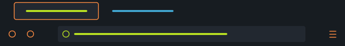

# B - Cube

[](LICENSE)
[](https://www.mozilla.org/firefox/)

Minimal, modern Firefox static theme (dark only).

**B - Cube**, Firefox için yalnızca koyu modda kullanılabilen, sade ve modern bir statik temadır.

**Kaynak / Source:** [github.com/bahadir-b-bekdemir/themes → mozilla-firefox-themes/b-cube](https://github.com/bahadir-b-bekdemir/themes/tree/main/mozilla-firefox-themes/b-cube)

---

## Kendi bilgisayarında yükleme / Install on your computer

1. Bu depoyu indirin veya klonlayın. / *Download or clone this repository.*
2. Firefox’ta adres çubuğuna `about:debugging` yazıp girin. / *In Firefox, type `about:debugging` in the address bar and press Enter.*
3. *Bu Firefox* / *This Firefox* sekmesinde **Geçici eklenti yükle** / **Load Temporary Add-on** düğmesine tıklayın.
4. `manifest.json` dosyasının bulunduğu `b-cube` klasörünü seçin. / *Select the `b-cube` folder that contains `manifest.json`.*

Tema yüklenecektir; geçici eklenti her Firefox yeniden başlatıldığında kaldırılır, tekrar yüklemeniz gerekir.  
*The theme will load; the temporary add-on is removed on each Firefox restart, so you need to load it again if you restart.*

---

## Görünüm / Preview

Temanın tarayıcıda nasıl göründüğü / How the theme looks in the browser:



*Koyu arka plan, turuncu ve yeşil-sarı vurgular; sekme çubuğu ve araç çubuğu.*  
*Dark background with orange and yellow-green accents; tab bar and toolbar.*

---

## Özellikler / Features

- **Koyu tema** — Göz yormayan koyu renk paleti  
- **Statik tema** — Yalnızca `manifest.json`; ek script veya izin gerekmez  
- **Manifest v3** — Güncel WebExtension standardı  

---

## Geliştirme / Development

### Gereksinimler / Requirements

- [Node.js](https://nodejs.org/) (LTS önerilir / LTS recommended)
- [Firefox](https://www.mozilla.org/firefox/)

### Bağımlılıkları yükleme / Install dependencies

```bash
npm install
```

### Geliştirme modunda çalıştırma / Run in development

```bash
npm run run
```

Firefox’ta geçici bir profil ile eklenti açılır.  
*Opens the add-on in Firefox with a temporary profile.*

### Derleme (paket oluşturma) / Build (create package)

```bash
npm run build
```

Çıktı `web-ext-artifacts/` klasöründe `.xpi` dosyası olarak oluşur.  
*Output is generated as a `.xpi` file in the `web-ext-artifacts/` folder.*

### Lint

```bash
npm run lint
```

---

## Proje yapısı / Project structure

```
b-cube/
├── manifest.json   # Tema tanımı (renkler vb.) / Theme definition (colors etc.)
├── package.json
├── images/
│   └── preview.png
├── README.md
├── LICENSE
└── .gitignore
```

---

## Lisans / License

Bu proje [MIT License](LICENSE) altında lisanslanmıştır.  
This project is licensed under the [MIT License](LICENSE).

© 2026 [Bahadır B. Bekdemir](mailto:bahadir.b.bekdemir@hotmail.com)
